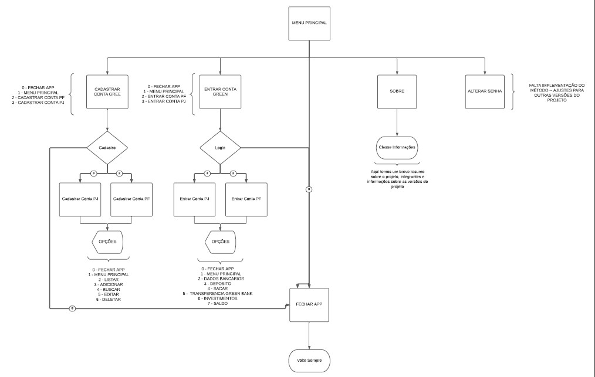

# Bank Account Project

>
## First Version of the Project:

>With only the knowledge learned, a project will be developed that involves all subjects and that will be maintained until the end of the course and > subsequent presentation to the evaluated board.
>
> To simulate teamwork, students will be divided into teams with four members, where each print the figures of the same team must be exchanged.
>
> How teams will be leveled so that they all have the same productive capacity, how teams will be maintained until the final presentation to facilitate the change of role and the evolution of the > same project until the final presentation
>
> Divide into smaller times to facilitate the management of each cell and practice teamwork.
>
> Each team will have 4 employees where activities will be internal strengths
>

  
<b>Portuguese 🗣️ </b>

  
### Primeira Versão do Projeto:

> Com o domínio apenas das informações aprendidas até o momento deve ser desenvolvido um projeto que envolva todos os assuntos e que será mantido até o final do curso e > posterior apresentação a banca avaliadora.
>
> Para simular o trabalho em equipe os alunos serão divididos em equipes com quatro integrantes, onde a cada sprint as figuras da mesma equipe devem ser trocadas.
>
> As equipes serão niveladas para que todas tenham a mesma capacidade produtiva, as equipes serão mantidas até o final para facilitar a troca de papeis e a evolução do > mesmo projeto até a apresentação final
>
> Dividir em times menores para facilitar o gerenciamento de cada célula e praticar o trabalho em equipe.
> 
> Cada equipe terá 4 integrantes onde as atividades serão divididas internamente

## Tecnologia

- IDE - 
- Backend - &nbsp;
- Replit - [Replit where we show the program in the future.](https://replit.com/~).

## Equipe - 

**Integrantes** **Time Verde**:

Número| Membro| Função | LinkedIn|
------|---------|-------|-------|
01| Thabata Santos|   Git|[</a>](https://www.linkedin.com/in/thabatasantos/)|
02| Arthur|   (CR)-UD UPDATE/DELETE|[</a>](link linkedin)|
03| Erick|   (CR)-UD READ/CREAT|[</a>](link linkedin)|
04| Rafel|   Main|[</a>](https://www.linkedin.com/in/rafael-macedo-49801011a/)|
||||

## Conceitos Utilizados

	
  
<b>💡&nbsp; Lógica de programação</b>

1. Git
    - Repositório
    - Documentação
    - README.md
    - Replit
2. Organização do projeto
    - Packages / sub-packages
    - Nomenclatura
3. Elementos básicos
    - variáveis
    - constantes
    - comentários
4. Estruturas de decisão
    - if, else-if, else
    - switch
5. Laços de repetição
    - for
    - while
    - do-while
6. Modularização
    - métodos com ou sem parâmetros e com ou sem retornos
    - recursividade

	
  
<b>🗃️&nbsp; Orientação a objetos</b>

  
1. Classes
    - diagrama de classe
    - atributos
    - construtores
    - encapsulamento
    - métodos específicos
    - instanciar objetos
2. Herança
    - extends
    - criar novos construtores com base na super classe
    - Polimorfismo
        - Apenas aproveitar os métodos
        - Fazer completamente de forma especifica
        - Sobrescrever para:
            - Fazer de forma especifica
            - Aproveitar o comportamento e fazer um complemento
3. Polimorfismo
    - interfaces

   
<b>⚠️&nbsp; Java avançado</b>

1. Classes wrapper
2. ENUM
3. Annotations
4. Collections
    - ArrayList
    - LinkedList
    - HashSet
    - HashMap
5. Funções Lambda
6. Generics
7. Dates
8. Exceptions

 

---

### Fluxograma

### Diagrama de Classes

